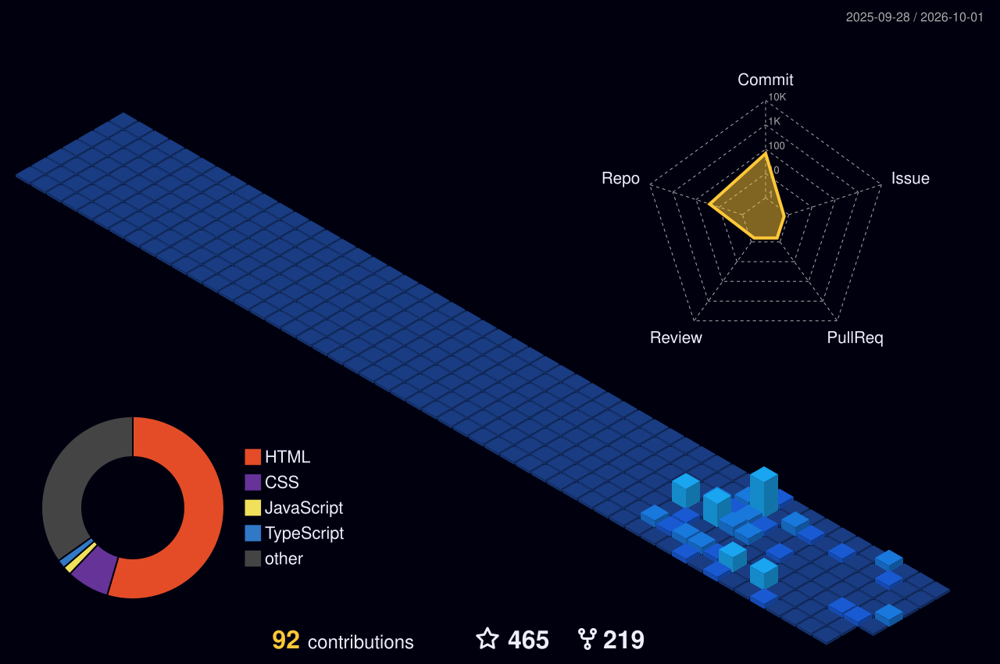

<!-- 🎬 HERO — video intro + name -->

  

<!-- 👩‍💻 LEFT: what I build   •   🏃 RIGHT: life outside code -->

  

<!-- ⚛️ TECH STACK -->

  

<!-- 🪪 DEVELOPER ID + DASHBOARD -->

  

## 🎌 Featured builds

| Project | What it is | Stack | Stars |
|:---|:---|:---|:---:|
| [**Naruto — Sage Mode**]() | Awwwards-style scroll experience with a thunder-crack transformation | `HTML` `CSS` `JS` `GSAP` | ⭐ 25 |
| [**Zoro — King of Hell**]() | Cinematic character landing page | `HTML` `CSS` `JS` | ⭐ 9 |
| [**Demon Slayer — Yoriichi & Kokushibo**]() | Split-screen duel storytelling | `HTML` `CSS` `JS` | ⭐ 8 |
| [**JJK — Sukuna**]() | Motion-heavy fan experience | `HTML` `CSS` `JS` | ⭐ 8 |
| [**One Piece 3D Website**]() | 3D web experience | `TypeScript` `Three.js` | ⭐ 2 |
| [**Impact**]() | Responsive landing build | `HTML` `CSS` | ⭐ 2 |

 

## 🌃 My contribution city

*Every commit builds another tower — rebuilt automatically every day.*

  

<!-- 💌 LET'S CONNECT -->

  

 

**Always learning, always building.** 💜

